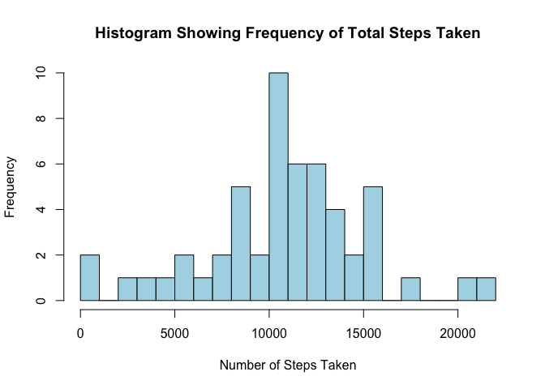

# Reproducible Research: Peer Assessment 1

In this project I will be looking at data from a fitness tracker. 
The [data][1] shows the number of steps take by one individual recorded at 5 minute 
intervals over the course of 61 days.

[1]: https://d396qusza40orc.cloudfront.net/repdata%2Fdata%2Factivity.zip

## Loading and preprocessing the data

The first step is to import the libraries:

```r
library(data.table)
library(knitr)
library(lubridate)
```

```
## 
## Attaching package: 'lubridate'
## 
## The following objects are masked from 'package:data.table':
## 
##     hour, mday, month, quarter, wday, week, yday, year
```

Next we import the data into R and load the data.table and knitr 
libraries.


```r
dataset <- data.table(read.csv("activity.csv"))
```

## What is mean total number of steps taken per day?
Using tapply I'll add up the total number of steps taken each day.

```r
StepsPerDay <- tapply(dataset$steps, dataset$date, sum)
StepsPerDaySum <- data.table(Date = as.Date(dimnames(StepsPerDay)[[1]]), 
                             Steps = StepsPerDay)
```


#####Mean steps per day
I know this is surprising but I'll use the mean function to calculate the mean
number of steps taken per day.

```r
mean(as.numeric(StepsPerDaySum$Steps), na.rm=TRUE)
```

```
## [1] 10766.19
```
#####Median steps per day
And the median number of steps per day:

```r
median(as.numeric(StepsPerDaySum$Steps), na.rm=TRUE)
```

```
## [1] 10765
```
#####Histogram of the frequency of total daily steps:
I set breaks to 20 in the histogram because it gives a sense of the range of 
steps but doesn't create so many breaks that they become very narrow and fragmented

```r
hist(StepsPerDaySum$Steps, breaks=20, xlab="Number of Steps Taken", 
     main="Histogram Showing Frequency of Total Steps Taken", col="lightblue")
```

 


## What is the average daily activity pattern?


## Imputing missing values


## Are there differences in activity patterns between weekdays and weekends?
